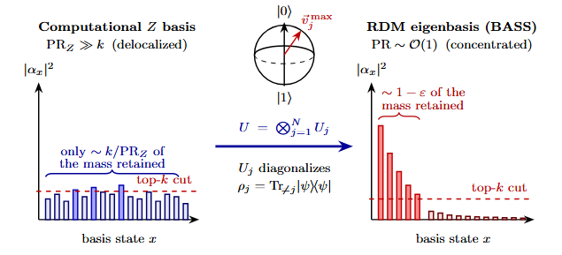
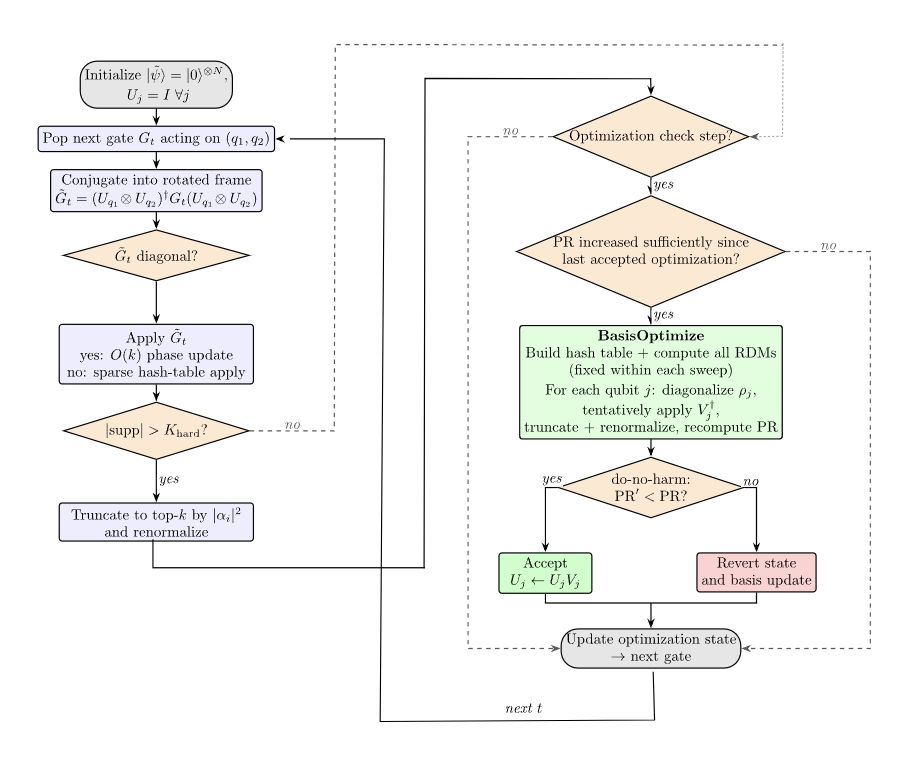

<h1 align="center"> Basis-Adaptive Sparse-State Simulation (BASS) </h1>

<p align="center">
  <a href="https://www.python.org/downloads/"></a>
  <a href="https://opensource.org/licenses/MIT"></a>
  <a href="#citation"></a>
</p>

<p align="center">
  <strong>A high-performance, research-oriented framework for sparse quantum circuit simulation using adaptive basis rotations.</strong>
</p>

## Table of Contents

- [Overview](#overview)
- [Workflow](#workflow)
- [Installation](#installation)
- [Repository Architecture](#repository-architecture)
- [Usage & Minimal Examples](#usage--minimal-examples)
  1. [Standard Simulation with BASS](#standard-simulation-with-bass)
  2. [Creating a New Circuit Family](#creating-a-new-circuit-family)
  3. [Running a Single Trial](#running-a-single-trial)
  4. [Timed Trials](#timed-trials)
  5. [k-Sweeps](#k-sweeps)
  6. [Multi-Trial Benchmark Sweeps](#multi-trial-benchmark-sweeps)
- [Reproducing the Paper](#reproducing-the-paper)
  1. [Fidelity & PR Analysis](#fidelity--pr-analysis) <a href="https://colab.research.google.com/github/Skill0issue/BASS-Basis-Adapative-Sparse-Simulations-/blob/main/tests/Fidelity_Pr.ipynb" target="_blank"></a>
  2. [N-Scaling Benchmarks](#n-scaling-benchmarks) <a href="https://colab.research.google.com/github/Skill0issue/BASS-Basis-Adapative-Sparse-Simulations-/blob/main/tests/NScaling.ipynb" target="_blank"></a>
  3. [Sparsity-Entanglement Phase Diagram](#sparsity-entanglement-phase-diagram) <a href="https://colab.research.google.com/github/Skill0issue/BASS-Basis-Adapative-Sparse-Simulations-/blob/main/tests/PhaseDiagram.ipynb" target="_blank"></a>
  4. [Runtime Overhead Verification](#runtime-overhead-verification) <a href="https://colab.research.google.com/github/Skill0issue/BASS-Basis-Adapative-Sparse-Simulations-/blob/main/tests/runtimeOverhead.ipynb" target="_blank"></a>
  5. [Rotation Diagnostics Matrix](#rotation-diagnostics-matrix) <a href="https://colab.research.google.com/github/Skill0issue/BASS-Basis-Adapative-Sparse-Simulations-/blob/main/tests/RotationDiagnostics.ipynb" target="_blank"></a>
  6. [Gamma Overestimation Diagnostics (Appendix F)](#gamma-overestimation-diagnostics-appendix-f) <a href="https://colab.research.google.com/github/Skill0issue/BASS-Basis-Adapative-Sparse-Simulations-/blob/main/tests/GammaOverstimationDiagnostics.ipynb" target="_blank"></a>
  7. [Schmidt-Based Truncating Suboptimality (Section IV)](#schmidt-based-truncating-suboptimality-section-iv) <a href="https://colab.research.google.com/github/Skill0issue/BASS-Basis-Adapative-Sparse-Simulations-/blob/main/tests/SchmidtWeightedTruncation.ipynb" target="_blank"></a>
- [References & Related Works](#related-work--references)
- [Citation](#citation)

## Overview

Exact simulation of an N-qubit quantum system requires storing $2^N$ complex amplitudes, making it computationally intractable for large systems. Sparse simulation approximates the quantum state by retaining only the k << $2^N$ largest amplitudes in the computational basis.

**The Limitation:** Traditional sparse simulators use a fixed Z-basis. When a state becomes highly entangled or undergoes scrambling (e.g., chaotic brickwork circuits), the probability mass spreads uniformly. The retained k amplitudes capture a vanishingly small fraction of the state, causing fidelity to collapse.

**The BASS Solution:** Inspired by the natural-orbital principle from quantum chemistry, **BASS (Basis-Adaptive Sparse-State Simulation)** periodically rotates each qubit into the eigenbasis of its single-qubit reduced density matrix (RDM) before truncation.

<p align="center">
  
</p>

By shifting the local frame to this "natural basis," BASS concentrates the probability mass into far fewer effective amplitudes. This allows the exact same top-k truncation budget to preserve exponentially more fidelity, extending the classical simulation boundary.

### ✨ Key Features

- **Adaptive Coordinate Descent:** Dynamically computes RDMs and rotates the state to minimize the Participation Ratio (PR).
- **Do-No-Harm Guard:** Rotations are strictly evaluated and reverted if they accidentally increase the participation ratio.
- **High-Performance JIT Kernels:** Core operations are accelerated using `Numba`, avoiding Python overhead during deep simulation loops.
- **Hash-Table Optimizations:** Utilizes open-addressing hash tables for $`O(k)`$ non-diagonal 2-qubit gate application and batched $`O(N*k)`$ RDM evaluations.
- **Sparsity-Entanglement Complementarity:** Operates in regimes inaccessible to canonical Matrix Product States (MPS) and standard fixed-basis methods.

---

## Workflow

<p align="center">
  
</p>

The `bass_simulator.py` executes the adaptive-basis sparse simulation through a highly optimized control-flow pipeline:

1. **Frame Conjugation:** When a gate $G_t$ acting on qubits $(q_1, q_2)$ is popped, it is conjugated into the current local eigenbasis frame defined by the accumulated single-qubit unitaries: $$\tilde{G}_t = (U_{q_1} \otimes U_{q_2})^\dagger G_t (U_{q_1} \otimes U_{q_2})$$
2. **Gate Dispatch (Fast-Paths):** - If the conjugated gate $\tilde{G}_t$ is strictly diagonal, BASS executes an $\mathcal{O}(k)$ phase update without allocating any new memory.
   - Otherwise, it falls back to a hash-table-based application to accumulate amplitudes natively at $\mathcal{O}(k)$ amortized cost.
3. **Deterministic Truncation:** If the state's support expands beyond the sparse budget $k$, it is immediately truncated down to the top-$k$ largest amplitudes by magnitude (Theorem 1).
4. **Adaptive Trigger:** Optimization isn't run blindly. Every $n_{opt}$ gates, BASS checks the Participation Ratio ($PR$). The optimization routine is triggered only if the $PR$ has degraded relative to the previous step (`pr_current > 0.9 * pr_last`).
5. **Basis Optimization (Coordinate Descent):** - Single-qubit Reduced Density Matrices ($\rho_j$) are computed via batched hash-table lookups.
   - For each qubit, the RDM is analytically diagonalized to find the natural eigenbasis ($V_j$).
   - The state is tentatively rotated into this new local basis.
6. **Do-No-Harm Guard:** The proposed rotation is evaluated. If the new Participation Ratio is strictly lower ($PR' < PR$), the update is accepted and accumulated ($U_j \leftarrow U_j V_j$). If it increases the $PR$, the state is exactly reverted.

---

## Installation

Clone the repository:

```bash
git clone https://github.com/Skill0issue/Basis-Adaptive-Sparse-Simulations.git
cd Basis-Adaptive-Sparse-Simulations
```

---

Create a Python virtual environment:

```bash
python -m venv venv
```

Activate the environment.

## Windows

```bash
venv\Scripts\activate
```

## Linux / macOS

```bash
source venv/bin/activate
```

Install dependencies:

```bash
pip install -r requirements.txt
```

---

# Module Initialization

Python imports require **init**.py files inside each package directory.

Generate them using the following commands:

## Windows PowerShell

```powershell
New-Item src/core/__init__.py
New-Item src/benchmarking/__init__.py
New-Item src/experimentation/__init__.py
New-Item src/simulation/__init__.py
New-Item src/utils/__init__.py
New-Item src/visualization/__init__.py
```

## Linux\MacOS bash

```bash
touch src/core/__init__.py
touch src/benchmarking/__init__.py
touch src/experimentation/__init__.py
touch  src/simulation/__init__.py
touch src/utils/__init__.py
touch src/visualization/__init__.py
```

---

# Repository Architecture

```text
src/
├── core/                      # Core data structures and Numba-optimized kernels
│   ├── sparse_state.py        # Memory-efficient state representation
│   ├── truncation.py          # JIT-compiled Top-k and Random-k truncation
│   └── gates.py               # Unitary matrix definitions
├── simulation/                # Simulators
│   ├── bass_simulator.py      # Core BASS algorithm (Hash-tables, RDM eigenbasis)
│   ├── simulator.py           # Baseline Fixed-Basis simulator
│   └── exact_simulator.py     # Dense statevector reference simulator
├── benchmarking/              # Diagnostics
│   └── fidelity.py            # Fidelity, PR, and entropy estimation tools
├── experimentation/           # Experiment orchestration
│   └── runner.py              # Scaling sweeps, timed trials and circuit helpers
├── utils/                     # Utilities
│   └── random_circuits.py     # Circuit generators
└── visualization/             # Styling
    └── style.py               # Publication-ready matplotlib styles

tests/
│
├── Fidelity&Pr.ipynb          # Fidelity and Participation ratio test
├── NScaling.ipynb             # qubit Scaling test at fixed and adaptive budgets
├── PhaseDiagram_updated.ipynb # Plot for circuit family regimes
├── RotationDiagnostics.ipynb  # Angle Diagonstics from natural RDM Basis
├── runtimeOverhead.ipynb      # Time overhead tests
│
├── figures/ # plots from tests files (generated automatically if not present)
│
└── results/ # results and metadata from tests (generated automatically if not present)
```

---

# Usage & Minimal Examples

## Standard Simulation with BASS

The BASS class can be used independently to simulate arbitrary circuits built from src.core.gates.

```Python
from src.simulation.bass_simulator import BASS
from src.core.gates import HGate, CNOTGate, RXGate

# 1. Define a circuit
N = 16
circuit = [
    HGate(0),
    HGate(1),
    CNOTGate(0, 1),
    RXGate(0, 3.1415/4)
]

# 2. Initialize BASS with a sparse budget (k)
sim = BASS(
    num_qubits=N,
    k=2048,
    optimize_every=5,         # Trigger basis optimization every 5 gates
    pr_opt_threshold=0.90,    # Adaptive trigger: run only if PR degraded
    use_diag_gate=True,       # Fast-path for Z-diagonal gates
    use_2qubit_rotations=False # Optional brick-wall 2-qubit RDM sweeps
)

# 3. Simulate and retrieve the state
sparse_state = sim.simulate(circuit)

# 4. Convert to dense statevector for verification (Recommended only for N <= 24)
psi = sim.to_statevector(sparse_state)

```

### Important BASS Parameters

| Parameter              | Description                            |
| ---------------------- | -------------------------------------- |
| `k`                    | Sparse truncation budget               |
| `optimize_every`       | Basis optimization interval            |
| `truncate_every`       | Deferred truncation interval           |
| `buffer_factor`        | Internal sparse buffer scaling         |
| `max_nnz_factor`       | Hard support-growth cap                |
| `use_2qubit_rotations` | Enables optional 2-qubit basis sweeps  |
| `pr_opt_threshold`     | Adaptive optimization trigger          |
| `use_diag_gate`        | Fast path for diagonal gates           |
| `use_fast_eigh`        | Analytical 2×2 eigensolver             |
| `use_kron_cache`       | Cache rotated-frame Kronecker products |

---

## Creating a New Circuit Family

Circuit families are simple Python functions with signature:

```python
def make_my_circuit(N, rng):
    ...
    return gates
```

Example:

```python
import numpy as np

from src.core.gates import (
    HGate,
    RXGate,
    RandomTwoQubitGate,
)

def make_my_circuit(N, rng):
    gates = []

    # Initial Hadamards
    for q in range(N):
        gates.append(HGate(q))

    # Random nearest-neighbour entangling layers
    for layer in range(4):
        for i in range(layer % 2, N - 1, 2):
            gates.append(
                RandomTwoQubitGate(
                    i,
                    i + 1,
                    seed=int(rng.integers(0, 2**31))
                )
            )

        # Random single-qubit rotations
        for q in range(N):
            theta = rng.uniform(0, np.pi)
            gates.append(RXGate(q, theta))

    return gates
```

---

## Running a Single Trial

Use `run_trial(...)` for fidelity and participation-ratio evaluation.

```python
from src.experimentation.runner import run_trial

f_fixed, f_bass, pr_fixed, pr_bass = run_trial(
    circuit_gen=make_my_circuit,
    N=16,
    k=2048,
    seed=0,
)

print("FixedBasis fidelity :", f_fixed)
print("BASS fidelity       :", f_bass)
print("FixedBasis PR       :", pr_fixed)
print("BASS PR             :", pr_bass)
```

---

## Timed Trials

Use `run_trial_timed(...)` for runtime benchmarking.

```python
from src.experimentation.runner import run_trial_timed

results = run_trial_timed(
    circuit_gen=make_my_circuit,
    N=18,
    k=4096,
    seed=0,
)

print(results["f_fixed"])
print(results["f_bass"])

print(results["t_fixed"])
print(results["t_bass"])
```

Returned fields:

```python
{
    "f_fixed",
    "f_bass",
    "pr_fixed",
    "pr_bass",
    "t_fixed",
    "t_bass",
    "circuit",
}
```

---

## k-Sweeps

Run sparse-budget scaling experiments using `run_sweep_k(...)`.

```python
from src.experimentation.runner import run_sweep_k

results = run_sweep_k(
    circuit_gen=make_my_circuit,
    N=16,
    k_values=[256, 512, 1024, 2048],
    n_trials=10,
    seed_base=42,
)

print(results.keys())
```

Returned fields:

```python
{
    "k_values",
    "f_fixed",
    "f_bass",
    "pr_fixed",
    "pr_bass",
}
```

---

## Multi-Trial Benchmark Sweeps

Use `run_comparison(...)` for averaged benchmark statistics.

```python
from src.experimentation.runner import (
    run_comparison,
    print_summary_table,
)

result = run_comparison(
    name="MyCircuit",
    circuit_gen=make_my_circuit,
    N=20,
    k=8192,
    n_trials=20,
)

print_summary_table([result])
```

This computes:

- geometric-mean fidelity ratios,
- multiplicative standard errors,
- win rates,
- per-trial statistics.

## Notes

- `run_trial(...)` and `run_trial_timed(...)` always use the SAME circuit instance for:
  - exact simulation,
  - fixed-basis simulation,
  - BASS simulation.

- Exact statevector simulation becomes memory intensive beyond roughly:

```python
N > 24
```

- BASS stores sparse states in the rotated frame internally and reconstructs
  the dense statevector only when `to_statevector(...)` is called.

- Custom circuit generators are fully compatible with all benchmarking
  utilities as long as they return a list of gate objects.

## Reproducing the Paper

This repository contains the exact code and Jupyter notebooks used to generate the figures and results in the paper. All experiments can be found in the `tests/` directory:


| Paper Figure / Section | Notebook & Source Verification | Description |
| :--- | :--- | :--- |
| <a name="fidelity--pr-analysis"></a>**Figure 4** | `Fidelity_Pr.ipynb` <a href="https://colab.research.google.com/github/Skill0issue/BASS-Basis-Adapative-Sparse-Simulations-/blob/main/tests/Fidelity_Pr.ipynb" target="_blank"></a> | State Fidelity ($F$) and Participation Ratio ($PR_Z$) scaling as a function of state budget ($k$) across structured quantum circuit architectures. |
| <a name="n-scaling-benchmarks"></a>**Figure 5** | `NScaling.ipynb` <a href="https://colab.research.google.com/github/Skill0issue/BASS-Basis-Adapative-Sparse-Simulations-/blob/main/tests/NScaling.ipynb" target="_blank"></a> | Multi-qubit scaling profiles ($N$) under both fixed-budget and exponentially scaled budget conditions demonstrating the adaptive basis advantage. |
| <a name="runtime-overhead-verification"></a>**Figure 7** | `runtimeOverhead.ipynb` <a href="https://colab.research.google.com/github/Skill0issue/BASS-Basis-Adapative-Sparse-Simulations-/blob/main/tests/runtimeOverhead.ipynb" target="_blank"></a> | Detailed wall-clock benchmarking and runtime complexity verification validating the lower-bounded $\mathcal{O}(N \cdot \text{nnz})$ hash-table kernel cost. |
| <a name="sparsity-entanglement-phase-diagram"></a>**Figure 8** | `PhaseDiagram.ipynb` <a href="https://colab.research.google.com/github/Skill0issue/BASS-Basis-Adapative-Sparse-Simulations-/blob/main/tests/PhaseDiagram.ipynb" target="_blank"></a> | The Sparsity-Entanglement Phase Diagram mapping benchmark families across localized macrostate distributions and entanglement regimes. |
| <a name="rotation-diagnostics-matrix"></a>**Figure 9** | `RotationDiagnostics.ipynb` <a href="https://colab.research.google.com/github/Skill0issue/BASS-Basis-Adapative-Sparse-Simulations-/blob/main/tests/RotationDiagnostics.ipynb" target="_blank"></a> | Microscopic single-qubit basis alignment and misalignment angle distributions ($\phi_j$) mapping coordinate descent optimization dynamics. |
| <a name="gamma-overestimation-diagnostics-appendix-f"></a>**Appendix F** | `GammaOverstimationDiagnostics.ipynb` <a href="https://colab.research.google.com/github/Skill0issue/BASS-Basis-Adapative-Sparse-Simulations-/blob/main/tests/GammaOverstimationDiagnostics.ipynb" target="_blank"></a> | Empirical validation suite investigating loose bounds and overestimation profiles of the cumulative tracking metric ($\gamma^2$) against strict mathematical state overlaps under dense truncation intervals. |
| <a name="schmidt-based-truncating-suboptimality-section-iv"></a>**Section IV** | `SchmidtWeightedTruncation.ipynb` <a href="https://colab.research.google.com/github/Skill0issue/BASS-Basis-Adapative-Sparse-Simulations-/blob/main/tests/SchmidtWeightedTruncation.ipynb" target="_blank"></a> | Computational framework demonstrating the suboptimality of non-local bipartite 1-3 Schmidt cut truncation strategies due to high entanglement overhead across active multi-qubit cuts. |


## Related Work & References

The theoretical foundation and benchmarking methodology of BASS build upon key literature across quantum circuit simulation and quantum chemistry:

- **Fixed-Basis Sparse Simulation Baseline:** Our fixed-basis comparison method follows the top-$k$ sparse-update principles formalized by Miller et al. (2026).
- **Natural-Orbital Theory:** The core inspiration for adaptive basis rotations stems from Löwdin's 1955 formulation of natural orbitals in quantum chemistry. Recent works have also explored mutual-information-based natural orbital selection for quantum circuit simulation, as demonstrated by Ratini et al. (2024).
- **Scrambling & Anticoncentration:** The exponential divergence between fixed-basis and adaptive-basis performance is tested using Haar-random and brickwork circuits, which are known to rapidly anticoncentrate and spread probability mass across the Hilbert space (Dalzell et al., 2022).
- **Tensor Network (MPS) Complementarity:** BASS operates in sparsity regimes orthogonal to the area-law entanglement structures exploited by canonical Matrix Product States (White, 1992; Orús, 2014).

### Selected Bibliography

1. B. N. Miller, P. K. Elgee, J. R. Pruitt, and K. C. Cox, _Approximate simulation of complex quantum circuits using sparse tensors_, arXiv:2602.04011 [quant-ph] (2026).
2. P.-O. Löwdin, _Quantum theory of many-particle systems. I. physical interpretations by means of density matrices, natural spin-orbitals, and convergence problems in the method of configurational interaction_, Phys. Rev. 97, 1474 (1955).
3. L. Ratini, C. Capecci, and L. Guidoni, _Mutual information-based selection of natural orbitals for quantum circuit simulation_, J. Chem. Theory Comput. 20, 3535 (2024).
4. A. M. Dalzell, N. Hunter-Jones, and F. G. S. L. Brandão, _Random quantum circuits anticoncentrate in log depth_, PRX Quantum 3, 010333 (2022).
5. S. R. White, _Density matrix formulation for quantum renormalization groups_, Phys. Rev. Lett. 69, 2863 (1992).

## Citation

If you find this framework useful in your research, please cite our paper:

```bibtex
@article{bass2026,
  title={Basis-Adaptive Sparse-State Simulation of Quantum Circuits},
  author={Kartikeya, Ch Nihar and K, Anjana and Sarma, Bijita and Borah, Sangkha},
  journal={arXiv preprint},
  year={2026}
}
```